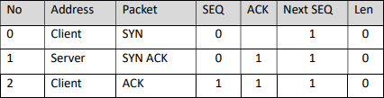
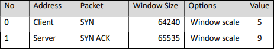
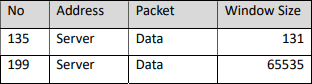

# TCP 3-Way Handshake

## SYN
The first packet in the 3-way handshake is the client attempting to connect to the server. The client sends an initial SYN packet with a SEQ number of 0.

## SYN/ACK
The server responds to the SYN packet with a SYN/ACK, and starts it's own SEQ number at 0. The server acknowledges receipt by sending back an ACK with the value of the server's SEQ + 1.

## ACK
The client receives the server's AYN/ACK and acknowledges receipt by sending back an ACK with the value of the server's SEQ + 1.

## Window size
The window size determines the maximum amount of data that can be received, and the TCP standard has an upper limit of 65535 bytes. However, during the 3-way handshake the initial SYN packets contain TCP options which allows this to be overridden.

When the client makes a connection to the server, it is stating that the maximum data size is 64240 bytes, but it has a window scale set to 5.   
To determine the maximum data size, take the window size and multiply it by 2^value.   

> 2^5 = 32   
> 64240 * 32 = 2,055,680 

When the server responds with a SYN ACK, it is stating that the maximum data size is 65535 bytes, but it has a window scale set to 9

> 2^9 = 512   
> 63355 * 512 = 33,553,920

The maximum size of data that the `client` can receive: 2055680 bytes   
The maximum size of data that the `server` can receive: 33553920 bytes   

This window scale can be used throughout the lifetime of the connection to determine the true window size, take for example the following:

Packet `135` is telling us that the maximum data size it will accept is `131` bytes, but as we already know the window scale we can adjust that value:   

> 2^9 = 512   
> 131 * 512 = 67,072

Packet `199` is telling us that the maximum data size it will accept is `65535` bytes, but as we already know the window scale we can adjust that value:   

> 2^9 = 512   
> 63355 * 512 = 33,553,920
