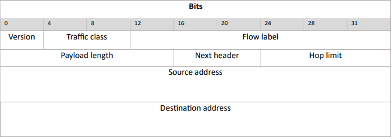

# Frames

## Media Access Control Address (MAC Address)

**OUI**   
This is the Organizationally Unique Identifier address. Examples of manufacturer 6-digit numbers include the following:   
   
    00000C (Cisco)   
    00001D (Cabletron)   
    0004AC (IBM [PCMCIA Ethernet adapter])   
    0020AF (3Com)   
    00C0A8 (GVC)   
    080007 (Apple)   
    080009 (Hewlett-Packard)   

**OUI**   
This is the Network Interface Controller Specific address. These bytes are unique to that particular card.

## Ethernet frame

**Dest Mac**   
The destination MAC address   

**Source Mac**  
The source MAC address   

**Ether type**   
This defines the type of data that is encapsulated in the frame, examples are:   

    0x0800 	Internet Protocol version 4 (IPv4)
    0x0806 	Address Resolution Protocol (ARP)
    0x0842 	Wake-on-LAN[8]
    0x8035 	Reverse Address Resolution Protocol (RARP)
    0x86DD 	Internet Protocol Version 6 (IPv6) 
    0x888E 	EAP over LAN (IEEE 802.1X)

**Data**
This is the payload of type `Ether type`

**FCS**   
Frame Check Sequence is an error detecting code, and in most cases this is a Cyclic Redundancy Check (CRC) code. This code is used for validation at every hop, and if the data is corrupted or modified then a checksum error is sent.

## IPv4 Header (20 bytes)

| Field      | Details  |
|------------|----------|
|**version**:| A 4-bit field describing the IP type used in the packet.| 
|**IHL**:| Internet Header length, a 4 bit field describing the length of the header. |
|**TOS**:| Type of Service, an 8 bit field  describing the type of service for the packet (i.e reliability, precedence, throughput, and delay).|
|**Total length**:| A 16-bit field that indicates the total size of the packet, with a maximum size of 65535 |
|**Identification**:| A 16-bit field that describes the identification number of a packet. If the data is fragmented, each piece will share the same value. |
|**Flags**:| A 3-bit field that enables fragmentation. The first bit is always 0, the second bit is set when data is fragmented, the third bit indicates there are more fragmented packets to follow.|
|**Fragment offset**:| A 13-bit field that determines to which part of the original packet this fragment belongs.|
|**Time to live**:| An 8-bit field that indicates the amount of time or the number of hops a packet can have before it is discarded.|
|**Protocol**:| An 8-bit field that specifies the upper layer protocol.|
|**Header checksum**:| A 16-bit field that calculates the checksum at every router hop. It is used to validate the header.|
|**Source address**:| A 32-bit field for the source IP address. |
|**Destination address**:| A 32-bit field for the destination IP address.|

## IPv6 Header (40 bytes)

| Field                  | Details  |
|------------------------|----------|
|**version**:            | A 4-bit field describing the IP type used in the packet.| 
|**Traffic Class**:      | An 8-bit field similar to the ToS field in the IPv4 header. The first 6-bits represent the service required for this packet, and the last 2-bits are used for Explicit Congestion Notification.|
|**Flow label**:         | A 20-bit field used to label packets belonging to the same sequence to ensure packets are delivered in the correct order. |
|**Payload length**:     | A 16-bit field that indicates the total size of the packet, with a maximum size of 65535 |
|**Next header**:        | An 8-bit field that indicates the type of the first extension header |
|**Hop limit**:          | This is the same as the TTL field in the IPv4 header. It indicates the number of hops a packet can take before being discarded.|
|**Source address**:     | A 128-bit IP address of the source device.|
|**Destination address**:| A 128-bit IP address of the destination device. |

## TCP Header

| Field                     | Details  |
|---------------------------|----------|
|**Source port**:           | A 16-bit port number defining the port number of the sender.  |
|**Destination port**:      | A 16-bit port number defining the port number of the recipient. |
|**Sequence number**:       | When you establish a new TCP connection the initial sequence number is a random 32 bit value. The receiver will use this sequence number and sends back an acknowledgment.|
|**Acknowledgement number**:| A 32-bit field is used by the receiver to request the next TCP segment. This value will be the sequence number incremented by 1.|
|**Length**:                | A 4-bit field that indicates the length of the TCP header so the location of the data can be determined. |
|**Flags**:                 | A 12-bit field that represents control bits, this is used to establish connections, send data and terminate connections:         |
|**Window**:                | A 16-bit window field specifies how many bytes the receiver is willing to receive.    |
|**Checksum**:              | A 16-bit checksum used to determine if the header is correct.  |
|**Urgent pointer**:        | A 16-bits pointer used to indicate where the urgent data ends. This is set when the URG flag has been set.  |
|**TCP Options**:           | This field is optional and can be anywhere between 0 and 320 bits. |

**Flags**   

- **URG**: Urgent pointer. When this bit is set, the data should be treated as priority over other data.
- **ACK**: Used for the acknowledgment.
- **PSH**: This is the push function. This tells an application that the data should be transmitted immediately and that we don’t want to wait to fill the entire TCP segment.
- **RST**: This resets the connection, when you receive this you have to terminate the connection right away. This is only used when there are unrecoverable errors and it’s not a normal way to finish the TCP connection.
- **SYN**: We use this for the initial three way handshake and it’s used to set the initial sequence number.
- **FIN**: This finish bit is used to end the TCP connection. TCP is full duplex so both parties will have to use the FIN bit to end the connection. This is the normal method how we end an connection